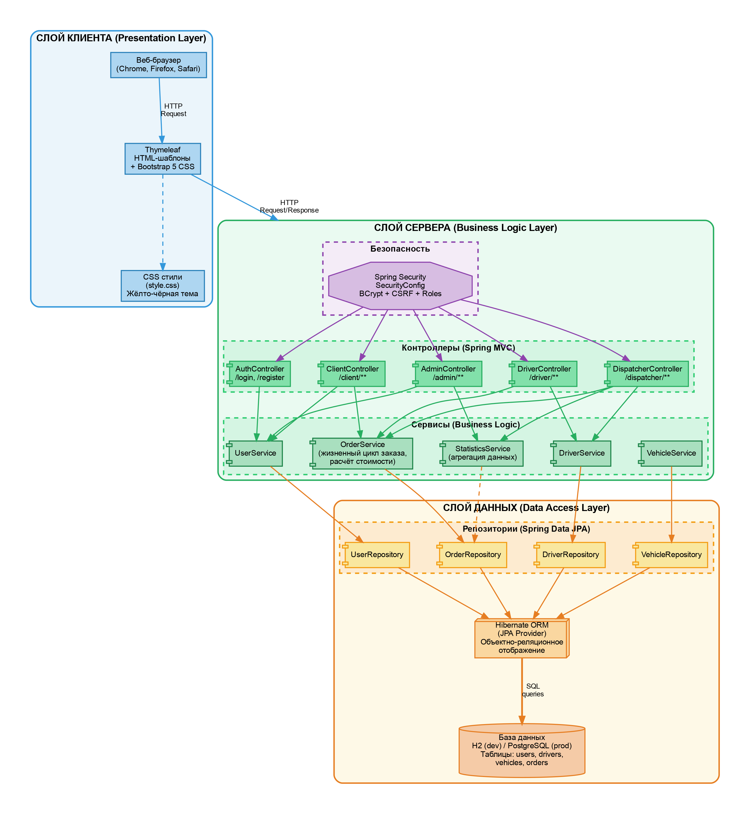
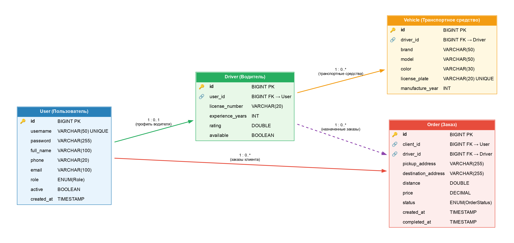
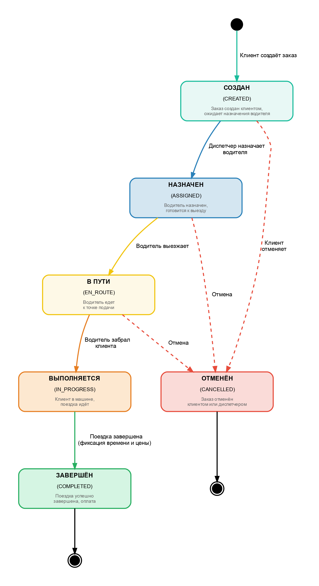
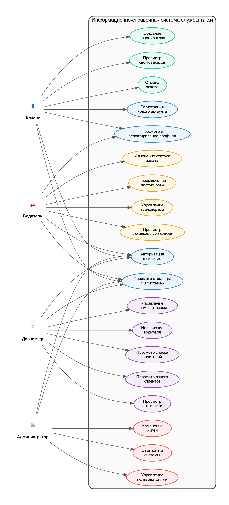
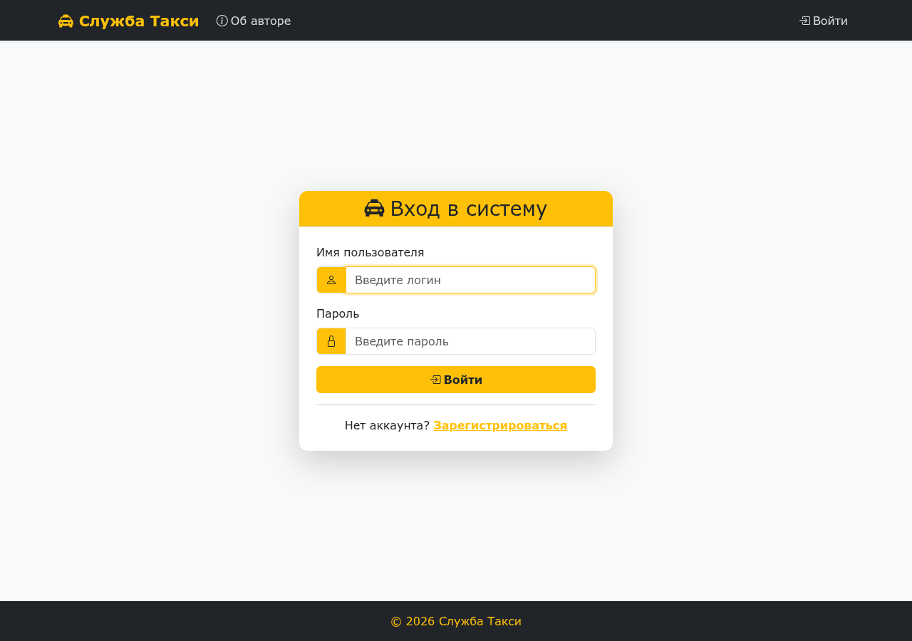
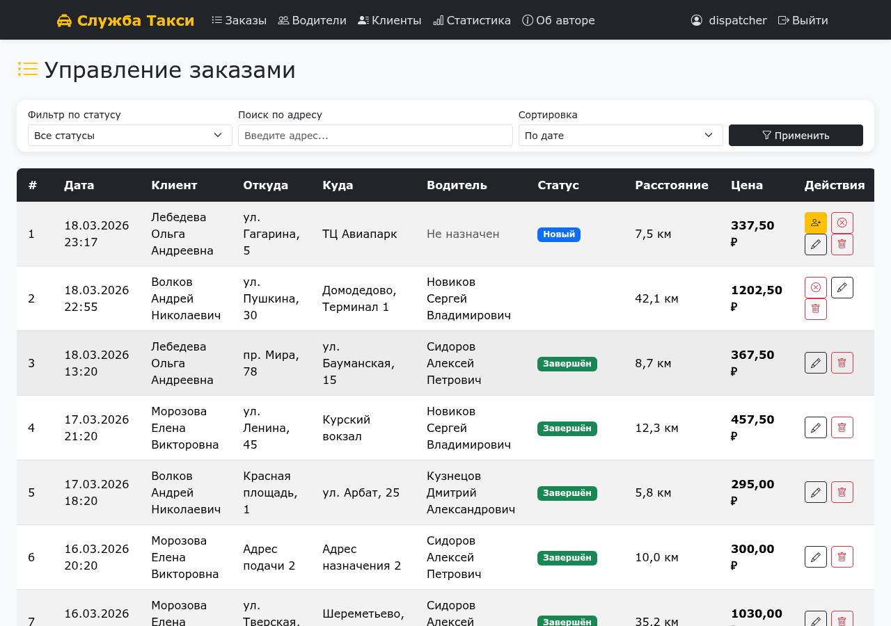
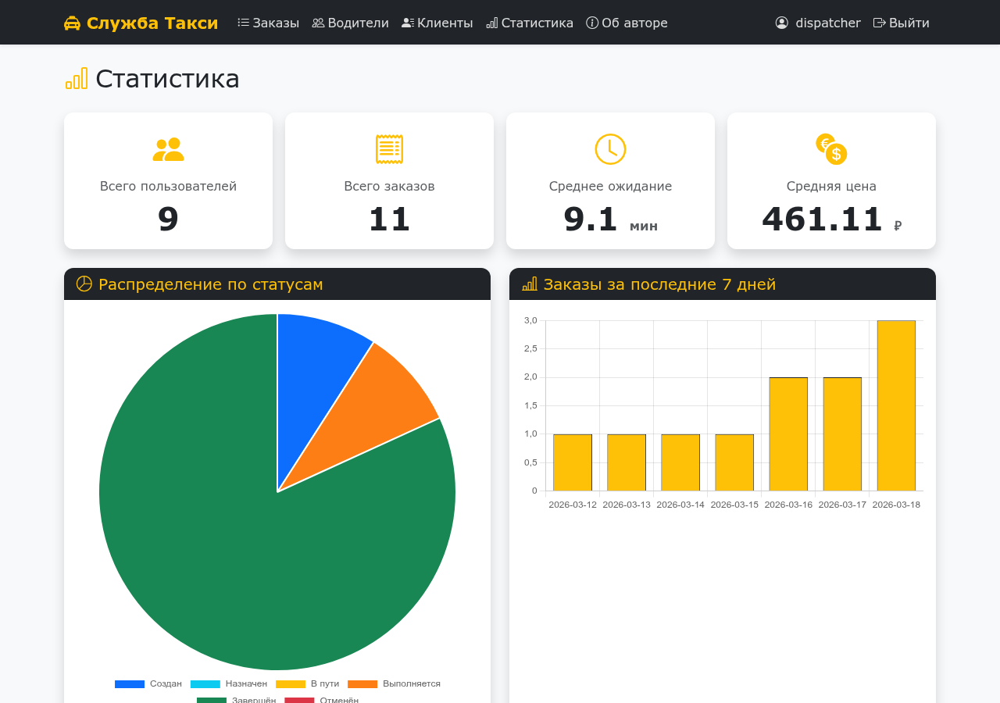
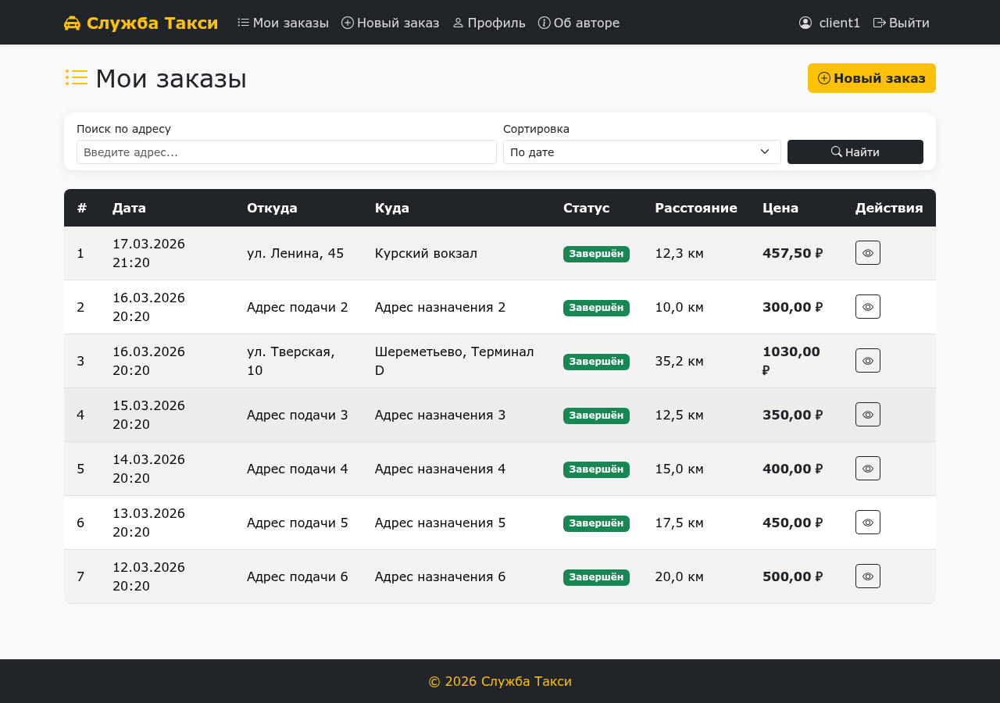
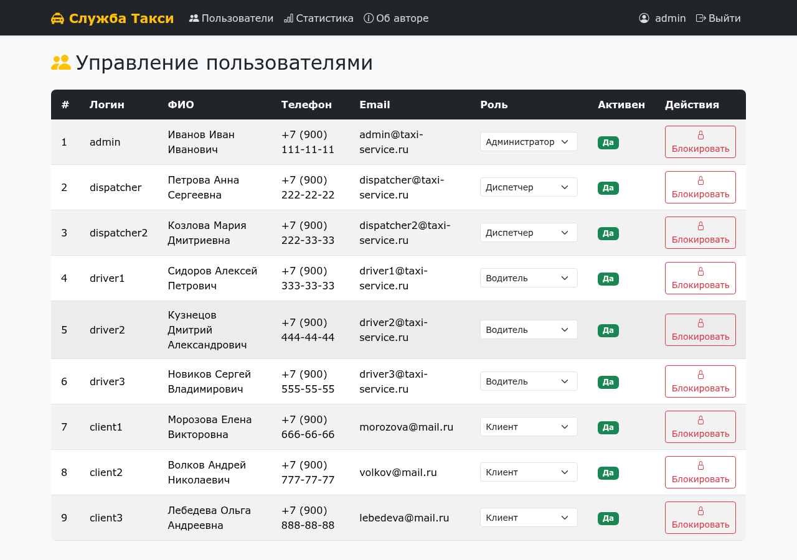

# Информационно-справочная система службы такси

Веб-приложение для автоматизации работы службы такси. Система позволяет клиентам создавать заказы, водителям принимать и выполнять их, а диспетчерам и администраторам управлять процессом и просматривать статистику.

## Стек технологий

| Технология | Версия | Назначение |
|---|---|---|
| Java | 17 (LTS) | Основной язык разработки |
| Spring Boot | 3.2 | Каркас приложения |
| Spring Security | 6.x | Аутентификация и авторизация |
| Spring Data JPA | 3.x | Доступ к данным |
| Hibernate | 6.x | ORM |
| Thymeleaf | 3.1 | Серверный шаблонизатор |
| Bootstrap | 5.3 | UI-компоненты |
| Chart.js | 4.x | Диаграммы и графики |
| H2 / PostgreSQL | 2.x / 15 | База данных (dev / prod) |
| Maven | 3.9 | Сборка проекта |

## Функциональность

- Регистрация и авторизация пользователей
- 4 роли: клиент, водитель, диспетчер, администратор
- CRUD-операции с заказами на поездки
- Управление водителями и транспортными средствами
- Назначение водителей на заказы, изменение статусов
- Поиск, фильтрация и сортировка
- Статистика с интерактивными диаграммами
- Страница «Об авторе»
- Обработка ошибок (404, 500)

## Запуск

```bash
# Клонирование
git clone https://github.com/xomyachok-shaolin/taxi-service-app.git
cd taxi-service-app

# Сборка и запуск
mvn spring-boot:run
```

Приложение будет доступно по адресу: http://localhost:8080

## Тестовые учётные записи

| Роль | Логин | Пароль |
|---|---|---|
| Администратор | admin | admin123 |
| Диспетчер | dispatcher | disp123 |
| Водитель | driver1 | driver123 |
| Клиент | client1 | client123 |

## Структура проекта

```
src/main/java/com/taxiservice/
├── config/          # Конфигурация (Security, DataInitializer)
├── controller/      # Контроллеры (Auth, Client, Driver, Dispatcher, Admin)
├── model/           # Сущности (User, Driver, Vehicle, Order)
├── repository/      # Репозитории (Spring Data JPA)
├── service/         # Сервисы (бизнес-логика)
└── TaxiServiceApplication.java

src/main/resources/
├── templates/       # Thymeleaf-шаблоны
├── static/css/      # Стили
└── application.properties
```

## Архитектура и диаграммы

<details>
<summary>Архитектура системы</summary>


</details>

<details>
<summary>ER-диаграмма</summary>


</details>

<details>
<summary>Жизненный цикл заказа</summary>


</details>

<details>
<summary>Use Case диаграмма</summary>


</details>

## Видеодемонстрация

[Смотреть видеодемонстрацию](https://github.com/xomyachok-shaolin/taxi-service-app/raw/master/demo.mp4)

В видео показаны: вход под каждой из 4 ролей, создание заказа, поиск, фильтрация, сортировка, статистика, страница «Об авторе», обработка ошибок.

## Скриншоты

<details>
<summary>Страница входа</summary>


</details>

<details>
<summary>Панель диспетчера — заказы</summary>


</details>

<details>
<summary>Статистика</summary>


</details>

<details>
<summary>Заказы клиента</summary>


</details>

<details>
<summary>Панель администратора</summary>


</details>
